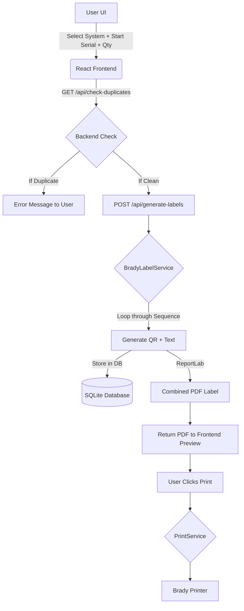

# System Patterns

## Architecture Overview
The system follows a client-server architecture:
- **Frontend:** React-based single-page application (SPA) for selecting systems, entering serial numbers, and previewing labels.
- **Backend:** Flask-based Python server handling sequential label generation, SQLite database management, and PDF creation.

## Key Technical Decisions

### 1. Sequential Batch Generation
Instead of single label triggers, the system supports batch generation. The user provides a start index and quantity, and the backend generates a range of labels.

### 2. Duplicate Prevention Database
An SQLite database is used to track every serial number printed.
- **Schema:** `labels (id, system_name, year, month, serial_number, printed_at)`
- **Constraint:** Unique index on `(system_name, year, month, serial_number)` to prevent any overlap.

### 3. Service-Oriented Backend
The backend is organized into specialized services:
- `BradyLabelService`: Handles QR code generation and text layout using ReportLab.
- `DatabaseService`: Manages SQLite interactions for duplicate checks.
- `PrintService`: Executes native OS print commands.

### 4. Label Layout Specification
- **Format:** PDF canvas sized to label dimensions.
- **QR Code Content:** `[YEAR][MONTH][SERIAL]`
- **Human-Readable Text:** Bottom-aligned, **Arial 8pt**.

## Data Flow

## Component Relationships
- `app.py`: Main Flask entry point and API route definitions.
- `services.py`: Contains `BradyLabelService`, `DatabaseService`, and `PrintService`.
- `LabelDashboard.jsx` (Frontend): Main UI for selecting systems and managing serial numbers.

